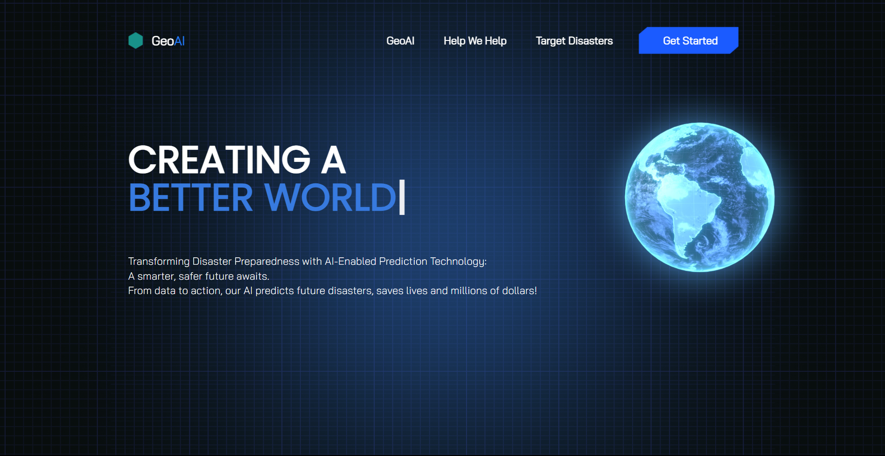
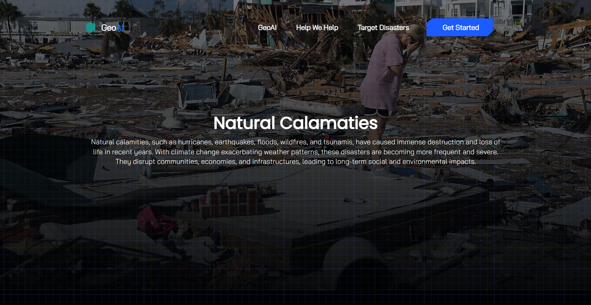
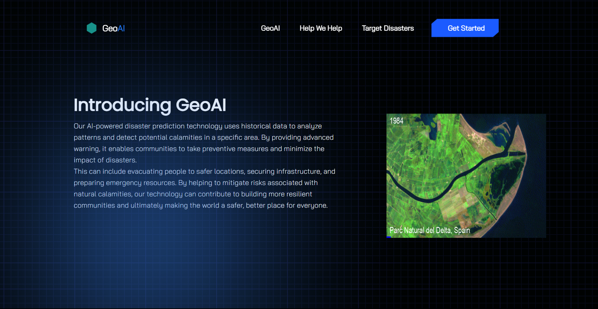

# GeoAI - Natural Calamity Detection

GeoAI is a platform for natural calamity detection, leveraging datasets and machine learning algorithms. This README specifically focuses on the frontend development part, which includes HTML, Tailwind CSS, and JavaScript. The project aims to provide an aesthetically pleasing and user-friendly UI for users.





## Table of Contents

- [Overview](#overview)
- [Installation](#installation)
- [Usage](#usage)
- [Technologies Used](#technologies-used)
- [Contributing](#contributing)
- [License](#license)

## Overview

GeoAI is a comprehensive project that harnesses the power of machine learning to detect and predict natural calamities. My contribution to this project involved creating the frontend part, which plays a crucial role in providing a user-friendly and visually appealing interface.

## Installation

1. Clone the repository:

   ```bash
   git clone https://github.com/sargunkohli152/GeoAI.git

2. Install dependencies
   ```bash
   npm install

3. Run the code in your code editor
   ```bash
   npm run start

## Usage
The frontend part of GeoAI serves as the user interface for interacting with the platform's natural calamity detection features. Users can:

 - View and interact with the machine learning models and predictions.
 - Access visualizations and data related to natural calamities.
 - Interact with user-friendly controls and features designed to enhance the user experience.

## Technologies Used
My contribution to the GeoAI frontend project utilized the following technologies:

 - HTML
 - Tailwind CSS
 - JavaScript

 ## Contributing
Contributions are welcome! If you have any suggestions, improvements, or want to enhance the frontend further, please fork the project, make your changes, and submit a pull request.

## License
MIT License

Permission is hereby granted, free of charge, to any person obtaining a copy of this software and associated documentation files (the "Software"), to deal in the Software without restriction, including without limitation the rights to use, copy, modify, merge, publish, distribute, sublicense, and/or sell copies of the Software, and to permit persons to whom the Software is furnished to do so, subject to the following conditions:

The above copyright notice and this permission notice shall be included in all copies or substantial portions of the Software.

THE SOFTWARE IS PROVIDED "AS IS", WITHOUT WARRANTY OF ANY KIND, EXPRESS OR IMPLIED, INCLUDING BUT NOT LIMITED TO THE WARRANTIES OF MERCHANTABILITY, FITNESS FOR A PARTICULAR PURPOSE AND NONINFRINGEMENT. IN NO EVENT SHALL THE AUTHORS OR COPYRIGHT HOLDERS BE LIABLE FOR ANY CLAIM, DAMAGES OR OTHER LIABILITY, WHETHER IN AN ACTION OF CONTRACT, TORT OR OTHERWISE, ARISING FROM, OUT OF OR IN CONNECTION WITH THE SOFTWARE OR THE USE OR OTHER DEALINGS IN THE SOFTWARE.
